<div align="center">

# Ciélio Queiroz — Portfólio

**Uma edição impressa que roda no navegador.**

Portfólio de um administrador com 15 anos de gestão financeira que virou desenvolvedor — e resolveu provar isso no próprio código do site.

[](https://nextjs.org)
[](https://www.typescriptlang.org)
[](https://react.dev)
[](https://tailwindcss.com)
[](https://vitest.dev)
[](https://vercel.com)

**[🌐 Ver o site](https://cielio-portfolio.vercel.app)** · **[💼 LinkedIn](https://www.linkedin.com/in/jacielio-queiroz/)** · **[📍 Santana do Araguaia – PA](https://maps.google.com/?q=Santana+do+Araguaia+PA)**

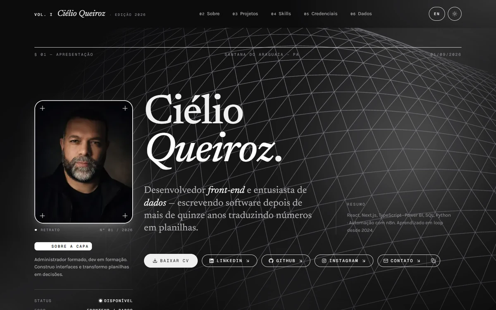

<sub>§ 01 — a capa, com o shader de ondas em WebGL ao fundo</sub>

</div>

---

## Sumário

- [Por que este site existe](#por-que-este-site-existe)
- [As sete seções](#as-sete-seções)
- [Como o site é montado](#como-o-site-é-montado)
- [Roteamento de idioma](#roteamento-de-idioma)
- [De onde vem cada conteúdo](#de-onde-vem-cada-conteúdo)
- [Os projetos, por dentro](#os-projetos-por-dentro)
- [Cor: uma fonte, três destinos](#cor-uma-fonte-três-destinos)
- [O que o CI cobra](#o-que-o-ci-cobra)
- [Stack](#stack)
- [Estrutura do projeto](#estrutura-do-projeto)
- [Rodando localmente](#rodando-localmente)
- [Como editar o conteúdo](#como-editar-o-conteúdo)
- [Deploy](#deploy)
- [Vocabulário e decisões](#vocabulário-e-decisões)
- [Licença](#licença)

---

## Por que este site existe

O público é recrutador com trinta a noventa segundos de atenção, metade em celular. Para esse leitor, um texto dizendo "escrevo código performático e acessível" não vale nada — o site precisa **ser** a prova.

Daí três regras que valem mais que qualquer parágrafo do currículo:

| Promessa | Como ela é cobrada, e não só afirmada |
|---|---|
| Performance é requisito | `scripts/check-bundle-budget.mjs` **falha o build** se o JS compartilhado passar de 115 kB gzipados |
| Conteúdo não sai errado | 145 testes cobrem o que o TypeScript não pega — inglês faltando, número que não fecha, URL duplicada |
| Nada de estética genérica de IA | Monocromático total, tipografia editorial, zero neon e zero glassmorphism decorativo |

A identidade é **_Fumaça Grafite_**: carvão quase-preto, texto cinza-claro e luz branca como único accent. A "fumaça" são os glows brancos difusos — todos acromáticos, para que nenhuma cor compita com os prints dos projetos. O tema claro é o gêmeo invertido: papel cinza, tinta grafite.

<table>
<tr>
<td width="50%"><br/><sub align="center">Tema escuro — o padrão</sub></td>
<td width="50%">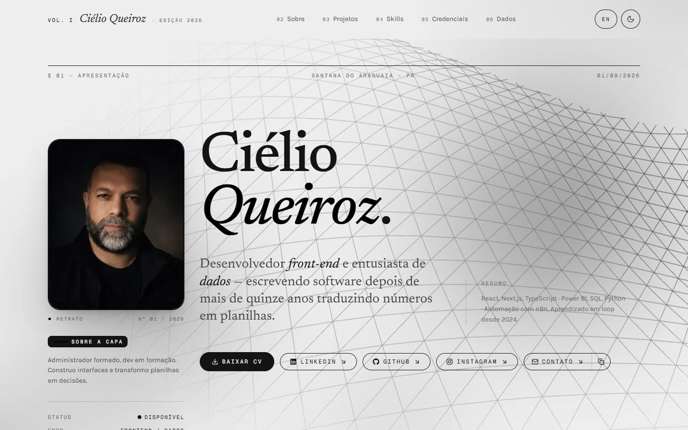<br/><sub>Tema claro — o gêmeo invertido</sub></td>
</tr>
</table>

---

## As sete seções

Cada uma numerada como capítulo de revista (`§ 01`, `§ 02`…), em português na raiz e em inglês sob `/en/`.

| § | Seção | O que é |
|---|---|---|
| 01 | Apresentação | Capa: retrato, nome, tagline, CTAs e o shader de ondas |
| 02 | Sobre mim | A travessia de admin/financeiro para dev, com pull quote |
| 03 | Projetos | 5 estudos de caso com página própria + arquivo vivo do GitHub |
| 04 | Skills | 22 tecnologias em 5 grupos, como índice tipográfico |
| 05 | Credenciais | Diploma + 49 certificados, filtráveis por categoria |
| 06 | Planilhas vivas | DRE com simulador de cenário e fluxo de caixa familiar |
| 07 | Colofão | Contato e créditos editoriais |

<table>
<tr>
<td width="50%">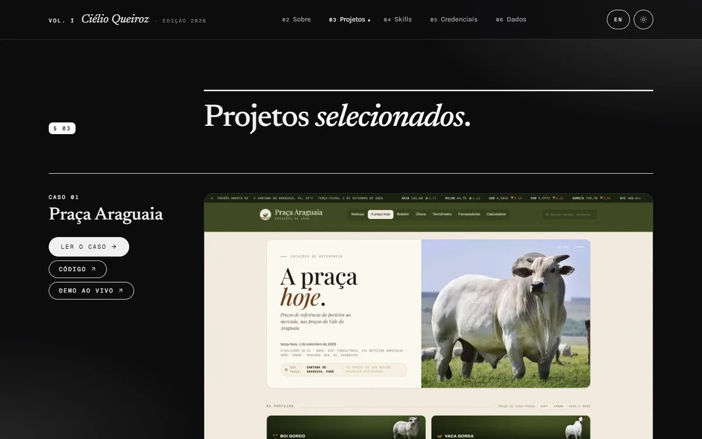<br/><sub>§ 03 — cada caso abre pelo print do sistema no ar</sub></td>
<td width="50%">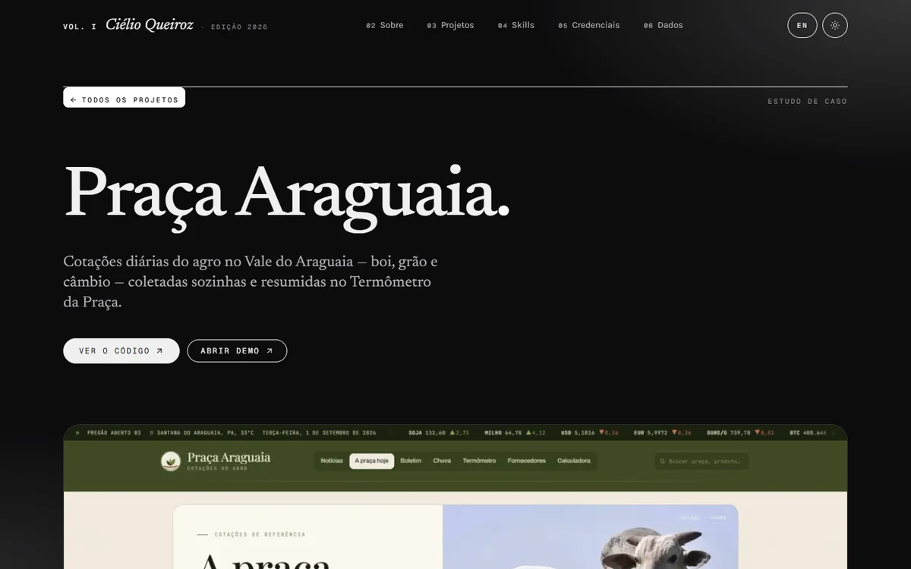<br/><sub><code>/projetos/[slug]</code> — página própria, com metadados e JSON-LD</sub></td>
</tr>
<tr>
<td>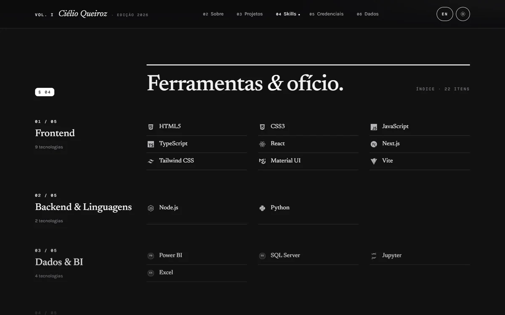<br/><sub>§ 04 — inventário, não nuvem de logos</sub></td>
<td>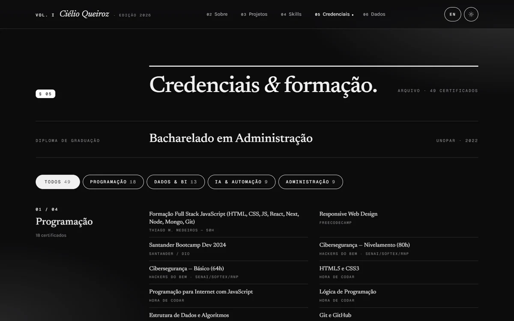<br/><sub>§ 05 — 49 certificados, filtráveis</sub></td>
</tr>
<tr>
<td>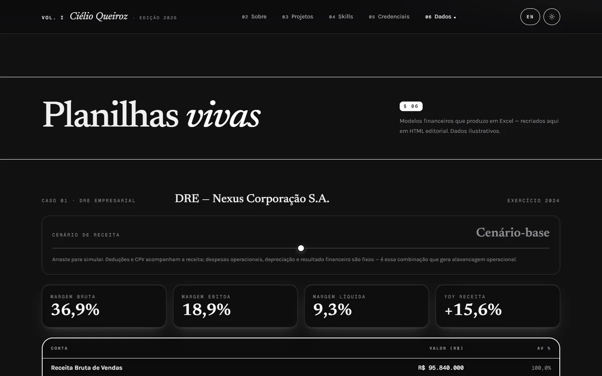<br/><sub>§ 06 — arraste o cenário e a cascata inteira recalcula</sub></td>
<td>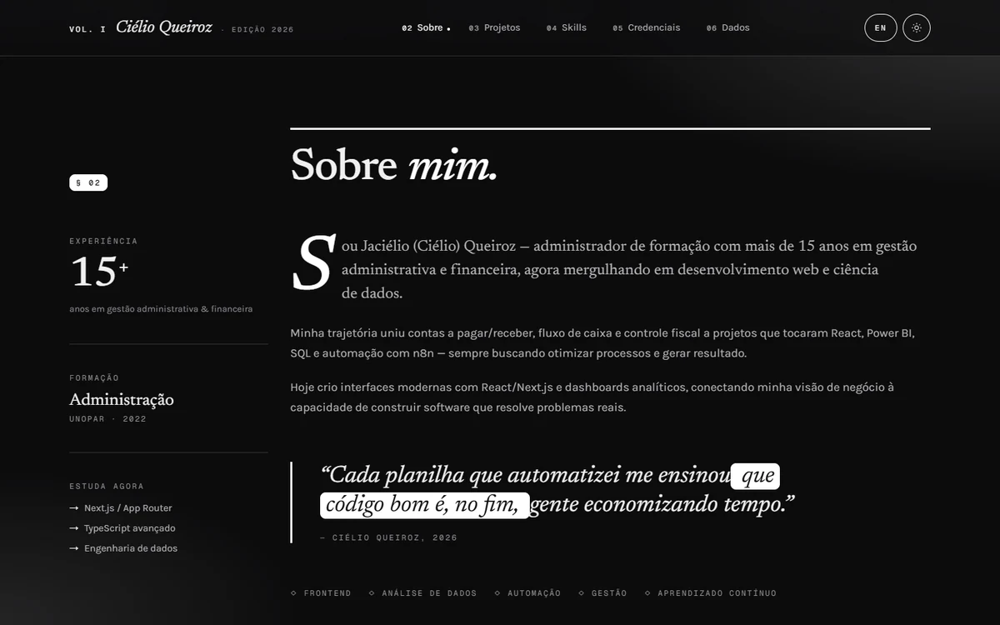<br/><sub>§ 02 — a ponte entre planilha e código</sub></td>
</tr>
</table>

<div align="center">
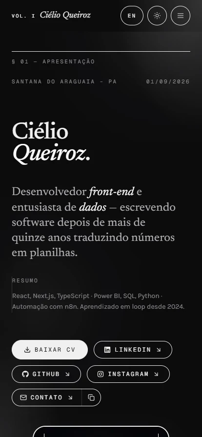

<sub>320 → 1920 px, com drawer em tela cheia no mobile</sub>
</div>

---

## Como o site é montado

A página chega pronta do servidor. O JavaScript que vai junto serve para o que **precisa** de navegador: tema, drawer, filtro das credenciais, slider da DRE, ondas 3D e o PDF do currículo.

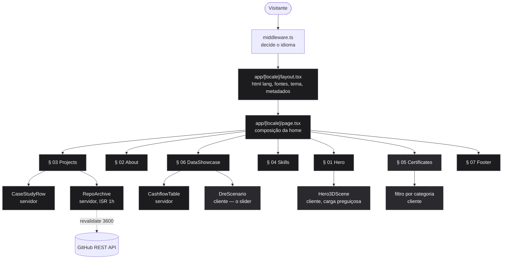

> Tracejado = precisa do navegador. O `.next` publicado tem 14 componentes cliente — tema, navbar, filtro, slider, tilt, revelação, CV e 3D; todo o resto do conteúdo já vai no HTML.

---

## Roteamento de idioma

Toda página mora em `app/[locale]/`, mas o português **não** ganha prefixo na URL — ele já estava indexado na raiz, e mudar de endereço quebraria os links existentes. O `middleware.ts` reconcilia as duas coisas ([ADR 0001](./docs/adr/0001-portugues-na-raiz-com-middleware.md)):

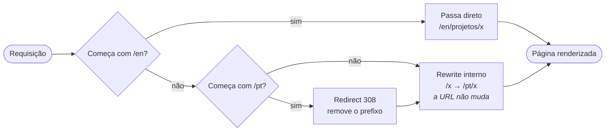

São **36 testes** só para este arquivo: eles garantem que nenhum redirect encadeia com outro e que a mesma página nunca responde em duas URLs diferentes — conteúdo duplicado é penalidade de SEO que ninguém percebe olhando a tela.

---

## De onde vem cada conteúdo

Nada de texto solto dentro de componente. Cada arquivo de conteúdo tem um motivo diferente para mudar, e é isso que define onde ele mora:

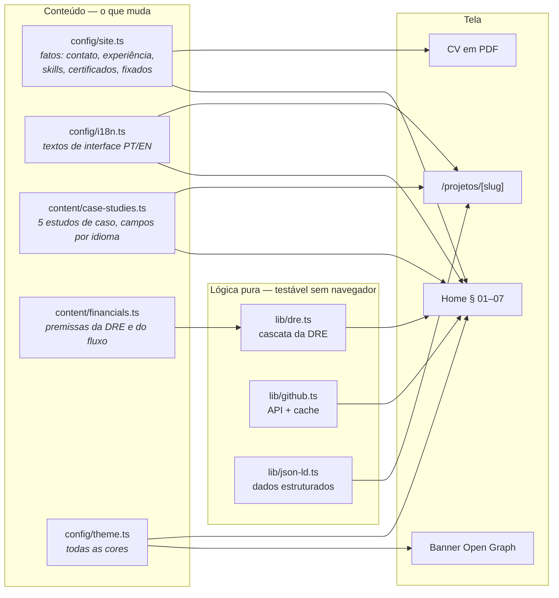

Adicionar um estudo de caso em `content/case-studies.ts` cria a página `/projetos/<slug>` nos dois idiomas, entra no `sitemap.xml` e ganha JSON-LD — sem tocar em mais nenhum arquivo.

---

## Os projetos, por dentro

A § 03 tem duas metades com propósitos diferentes. Os **estudos de caso** são texto redigido: problema, solução e aprendizado, com print do sistema no ar. O **arquivo vivo** é a lista de repositórios, buscada na GitHub API no servidor e revalidada de hora em hora ([ADR 0003](./docs/adr/0003-repositorios-buscados-no-servidor.md)):

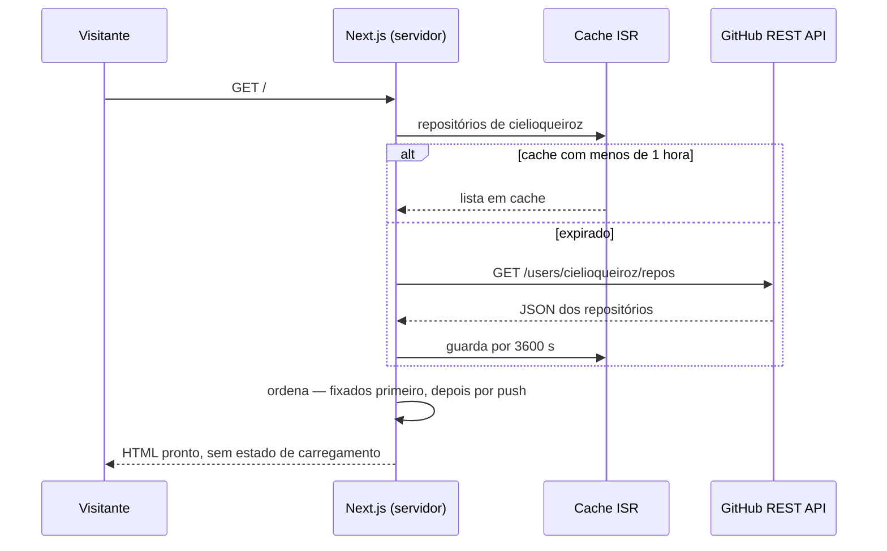

Buscar no servidor resolve três problemas de uma vez: o conteúdo é indexável, o visitante não gasta a própria cota da API e ninguém vê spinner. A ordem dos fixados vem de `config/site.ts`, escrita à mão — a API pública não expõe os *pinned* do perfil ([ADR 0005](./docs/adr/0005-fixados-mantidos-a-mao.md)).

Os cinco casos publicados hoje:

| # | Caso | O que é | Código · Demo |
|---|---|---|---|
| 01 | **Praça Araguaia** | Cotações diárias do agro no Vale do Araguaia, coletadas por rotina agendada | [código](https://github.com/cielioqueiroz/praca-araguaia) · [demo](https://agroapp-bay.vercel.app) |
| 02 | **Capital Financeiro** | Fatura ou extrato em PDF vira gráfico, com leitura dentro do navegador | [código](https://github.com/cielioqueiroz/controle-financeiro) · [demo](https://capital-financeiro.vercel.app) |
| 03 | **Vaga Certa** | Currículo entra, vagas reais saem com nota de 0 a 100 e o porquê de cada match | [código](https://github.com/cielioqueiroz/buscador-de-cv) · [demo](https://vaga-certa-sooty.vercel.app) |
| 04 | **gabarito_AI** | Edital ou prova em PDF vira plano de estudos, questões e flashcards | [código](https://github.com/cielioqueiroz/gabarito_AI) · [demo](https://gabarito-lyart.vercel.app) |
| 05 | **Rendimento** | Juros compostos com IR e inflação descontados, onze aplicações no mesmo cenário | [código](https://github.com/cielioqueiroz/calculadora-investimentos) · [demo](https://rendimento-omega.vercel.app) |

---

## Cor: uma fonte, três destinos

Nenhum arquivo em `styles/` contém um valor literal de cor. Todos consomem variáveis, e as variáveis nascem de um lugar só — trocar o tema inteiro do site é editar um arquivo:

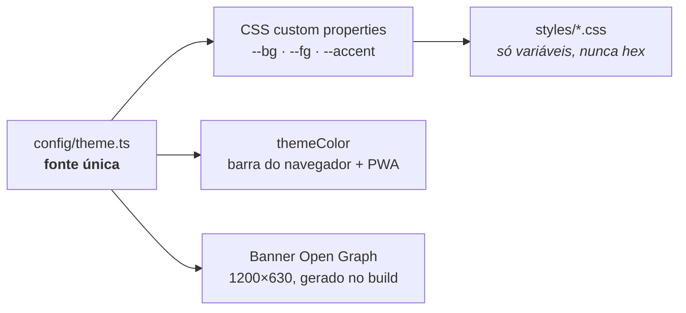

---

## O que o CI cobra

Antes de qualquer deploy, o workflow `quality.yml` roda testes, build, typecheck, lint e o orçamento de bundle. Os 145 testes cobrem justamente o que o compilador não vê:

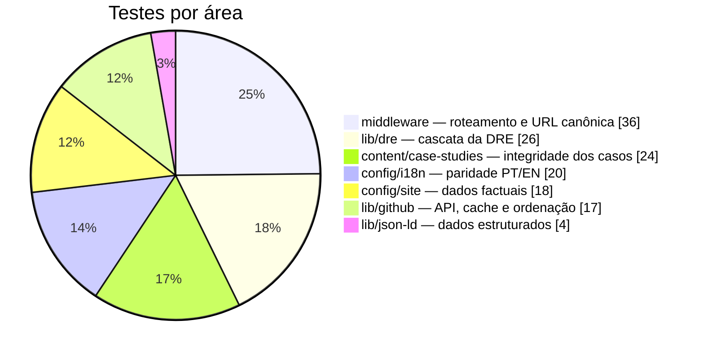

Exemplos do que cada grupo pega antes do ar: a cascata da DRE fecha e reproduz os números publicados; nenhuma categoria aparece sem tradução na versão em inglês; nenhum estudo de caso vai ao ar com o campo inglês vazio ou copiado do português; o print declarado existe, tem as dimensões que diz ter e não passa de 120 kB.

**Orçamento de bundle** — JS compartilhado por todas as rotas, gzipado:


| | Valor | O que acontece |
|---|---|---|
| Hoje | **100,7 kB** | 88% do teto — folga para crescer sem travar o trabalho |
| Teto | **115 kB** | acima disso o `npm run build` **falha** no CI |

O teto não é decoração: subir de patamar exige mudar `BUDGET_KB` e justificar no commit por que o aumento vale a pena.

---

## Stack

| Camada | Ferramenta |
|---|---|
| Framework | [Next.js 15](https://nextjs.org/) — App Router, RSC e ISR |
| Linguagem | [TypeScript](https://www.typescriptlang.org/) strict |
| UI | [React 19](https://react.dev/) |
| Estilização | [Tailwind CSS 3](https://tailwindcss.com/) + CSS custom properties |
| Tema | [next-themes](https://github.com/pacocoursey/next-themes) — claro/escuro com persistência |
| Tipografia | Newsreader (display, variável, com itálico de verdade), Karla (corpo), Geist Mono (metadados) |
| Ícones | [lucide-react](https://lucide.dev/) na UI, [react-icons](https://react-icons.github.io/react-icons/) nas tecnologias |
| Dados dos repositórios | [GitHub REST API](https://docs.github.com/en/rest) — no servidor, revalidada de hora em hora |
| CV em PDF | [@react-pdf/renderer](https://react-pdf.org/) — gerado no navegador, sob demanda |
| 3D | [three.js](https://threejs.org/) + React Three Fiber — shader GLSL de ondas |
| Testes | [Vitest](https://vitest.dev/) — 145, ao lado do que testam |
| Hospedagem | [Vercel](https://vercel.com/) — deploy a cada push em `main` |

**Acabamento que não aparece no print:** ondas 3D desligadas em hardware fraco (≤ 2 núcleos) e congeladas com `prefers-reduced-motion`; revelação ao rolar via `animation-timeline: view()`, com fallback; skip link localizado, foco visível, navegação por teclado e `aria-label` em todos os controles; CSP escrita à mão, com as duas frouxidões deliberadas documentadas em [ADR 0004](./docs/adr/0004-csp-escrita-a-mao.md).

---

## Estrutura do projeto

```
my-portifolio/
├── middleware.ts                Roteamento de idioma (pt na raiz, en com prefixo)
├── app/
│   ├── [locale]/
│   │   ├── layout.tsx           <html lang>, fontes, tema, metadados
│   │   ├── page.tsx             Composição da home
│   │   ├── not-found.tsx        404 editorial
│   │   ├── providers.tsx        ThemeProvider
│   │   └── projetos/[slug]/     Página de cada estudo de caso
│   ├── icon.svg                 Favicon
│   ├── manifest.ts              PWA (cores vindas de config/theme.ts)
│   ├── opengraph-image.tsx      Banner OG 1200×630 gerado no build
│   ├── robots.ts / sitemap.ts   SEO — o sitemap cobre as duas línguas
│   └── twitter-image.tsx
├── components/
│   ├── Navbar.tsx               Masthead + drawer mobile + scrollspy
│   ├── Hero.tsx                 Capa § 01
│   ├── About.tsx                Sobre § 02
│   ├── Projects.tsx             Projetos § 03 (casca)
│   │   └── projects/
│   │       ├── CaseStudyRow.tsx   Um caso na home
│   │       ├── RepoArchive.tsx    Arquivo vivo do GitHub (servidor)
│   │       └── RepoCard.tsx       Card de um repositório
│   ├── Skills.tsx               Skills § 04
│   ├── Certificates.tsx         Credenciais § 05
│   ├── DataShowcase.tsx         Planilhas vivas § 06 (casca)
│   │   └── data/
│   │       ├── DreScenario.tsx    DRE com slider (cliente)
│   │       └── CashflowTable.tsx  Fluxo de caixa (servidor)
│   ├── Footer.tsx               Colofão § 07
│   ├── Hero3DMount.tsx          Carga preguiçosa das ondas
│   ├── Hero3DScene.tsx          Canvas WebGL com shader
│   ├── AuroraBackdrop.tsx       Gradiente aurora em CSS puro
│   ├── CVDocument.tsx           O currículo em PDF
│   └── …                        Portrait, Tilt3D, SplitReveal, ThemeToggle…
├── config/
│   ├── site.ts                  Dados factuais + repositórios fixados
│   ├── i18n.ts                  Textos de interface PT/EN + helpers de rota
│   └── theme.ts                 FONTE ÚNICA de cor
├── content/
│   ├── case-studies.ts          Os 5 estudos de caso (um registro, campos por idioma)
│   └── financials.ts            Modelo da DRE e do fluxo de caixa
├── lib/
│   ├── github.ts                GitHub API (servidor, com cache)
│   ├── dre.ts                   Cascata da DRE — função pura
│   └── json-ld.ts               Dados estruturados
├── styles/                      base · layout · typography · surfaces · controls · motion
├── scripts/
│   └── check-bundle-budget.mjs  Orçamento de JS no CI
├── public/projetos/             Os prints dos estudos de caso (WebP)
├── .github/
│   ├── screenshots/             Os prints deste README
│   └── workflows/
│       ├── quality.yml          Testes + build + typecheck + lint + orçamento
│       └── pages-redirect.yml   Publica o redirect do domínio antigo
├── CONTEXT.md                   Glossário do domínio
├── PRODUCT.md                   Público, personalidade de marca e anti-referências
└── docs/adr/                    Por que é assim — não como
```

---

## Rodando localmente

Pré-requisito: **Node.js 20+**.

```bash
git clone https://github.com/cielioqueiroz/cielioqueiroz.github.io.git
cd cielioqueiroz.github.io
npm install
npm run dev
```

Abra `http://localhost:3000`.

### Variáveis de ambiente

Nenhuma é obrigatória. Uma é recomendada:

| Variável | Efeito |
|---|---|
| `GITHUB_TOKEN` | Autentica as chamadas à GitHub API. Sem ela o site funciona igual, com o limite público de 60 requisições/hora — o cache de 1 hora deixa isso confortável. |

Copie `.env.example` para `.env.local` se quiser configurá-la.

### Scripts

| Comando | O que faz |
|---|---|
| `npm run dev` | Servidor de desenvolvimento com hot reload |
| `npm run build` | Build de produção |
| `npm run start` | Serve o build de produção |
| `npm run lint` | ESLint (flat config — o `next lint` foi descontinuado) |
| `npm test` | Roda os 145 testes uma vez |
| `npm run test:watch` | Testes em modo observador |
| `npm run budget` | Verifica o orçamento de bundle (exige `build` antes) |

---

## Como editar o conteúdo

| Arquivo | O que fica lá |
|---|---|
| [`config/site.ts`](./config/site.ts) | Nome, contato, experiência, formação, skills, certificados e os **repositórios fixados** — fixou outro no GitHub? Atualize `pinnedRepos`, é o que define a ordem do arquivo vivo |
| [`config/i18n.ts`](./config/i18n.ts) | Textos de interface em PT e EN — rótulos, títulos de seção, mensagens |
| [`content/case-studies.ts`](./content/case-studies.ts) | Os estudos de caso. Um registro por projeto, com os campos redigidos em cada idioma |
| [`content/financials.ts`](./content/financials.ts) | Premissas da DRE e linhas do fluxo de caixa |
| [`config/theme.ts`](./config/theme.ts) | **Todas** as cores. App, banner OG e manifest leem daqui |

**Publicar um estudo de caso novo:** adicione o registro em `content/case-studies.ts` e o print em `public/projetos/<slug>.webp` — 1400 px de largura, WebP com perda, até 120 kB, com as dimensões reais declaradas no registro. O teste cobra as três coisas; a página, o sitemap e o JSON-LD saem sozinhos.

Trocar o retrato: substituir `public/portrait.webp` (4:5 vertical funciona melhor).

---

## Deploy

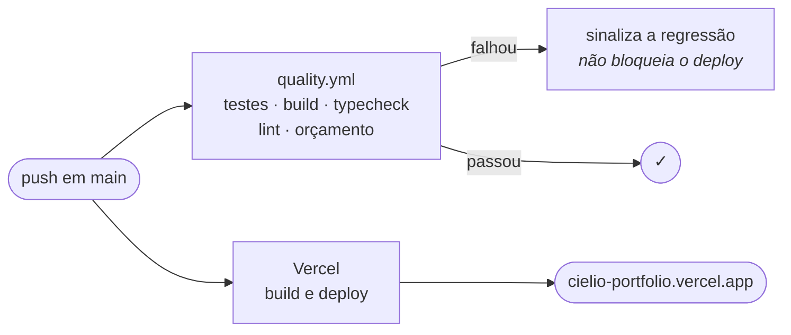

Pull request ganha preview próprio. O domínio antigo `cielioqueiroz.github.io` continua no ar, mas apenas como redirecionamento permanente — o conteúdo de `redirect/` é publicado pelo workflow `pages-redirect.yml`.

---

## Vocabulário e decisões

Dois lugares existem para quem for ler o código (inclusive eu, daqui a seis meses):

- **[`CONTEXT.md`](./CONTEXT.md)** — o glossário. O site usa palavras vizinhas para coisas diferentes: *estudo de caso* não é *repositório*, *cenário* não é *premissa*, *credencial* não é *certificado*. Trocar uma pela outra gera bug de conteúdo que nenhum tipo pega.
- **[`docs/adr/`](./docs/adr/)** — registros de decisão. Só entra o que é caro de reverter e surpreendente para quem chega:

| ADR | Decisão |
|---|---|
| [0001](./docs/adr/0001-portugues-na-raiz-com-middleware.md) | Português na raiz, com middleware |
| [0002](./docs/adr/0002-sair-do-static-export.md) | Sair do export estático |
| [0003](./docs/adr/0003-repositorios-buscados-no-servidor.md) | Repositórios buscados no servidor |
| [0004](./docs/adr/0004-csp-escrita-a-mao.md) | CSP escrita à mão |
| [0005](./docs/adr/0005-fixados-mantidos-a-mao.md) | Fixados mantidos à mão |

---

## Licença

Código sob licença **MIT**. O conteúdo — textos, retrato, certificados — é pessoal e não está coberto pela licença.

<div align="center">
<br/>
<sub>Feito em Santana do Araguaia – PA · <a href="https://cielio-portfolio.vercel.app">cielio-portfolio.vercel.app</a></sub>
</div>
